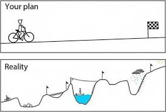
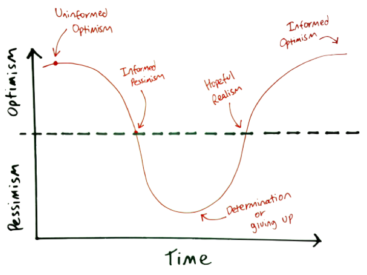

# How to Successfully Learn in This Bootcamp

## Learning Objectives

- What we are looking for in students
- General advice and how to prepare yourself emotionally.
- Some qualities of the most successful students.
- Classroom culture.
- Overview of "grit."
- Overview of common student concerns.

## What we are looking for in students

We have certain qualities that we look for in students.  At the end of each unit, you will vote on which of your fellow classmates best exemplifies the following traits:

- Researcher - shared the best online resources
- Camera Director - reminded instructors to record/share
- Homework Helper - most helpful with homework
- Most Courageous - asked questions I was afraid to ask
- Class Clown
- Morale Booster - most supportive
- Elegant Coder
- Social Butterfly
- Code Wrangler - solved the toughest problems
- Eagle Eye - spotted the most bugs in class
- Lab Technician - most helpful during labs
- Style Master - best looking pages

## Emotional Framing

- Things will not go as you plan 

- Deal with chaos in your head. Being confused/lost is **NORMAL**. No one pays you because you know all the answers. The job is about jumping into confusion and being able to find a solution.  Make friends with discomfort.

- The maximum point of learning is right at the edge of learning and panic. (The Learning Zone Model by Tom Senninger) 

- This experience is a rollercoaster. 

## Successful students

- The most successful students find programming fascinating. They don't think of it as an obligation or chore.

- The most successful students go above and beyond what we teach. If there is something they feel they should know, they will go and learn it. If there is a problem they think they need more information to solve, they go and find that information.

- The most successful students don't wait for instructors to hand them the answer.

-  Successful students quickly see that programming is not about learning a recipe; it's about developing a mindset to solve unforeseen problems.

- Hard Work: the equivalent of two full-time jobs (~80 hrs per week).

- Be open and ready to receive constructive criticism.

## Classroom Culture

- Open and safe environment.
- Take ownership of your experience.
- Check your ego at the door.
- Empathy.
- Be courteous calm and patient with others. Don't let the stress get to you!
- Don't compare yourself to others, compare yourself to who you were yesterday.

### Mentorship / Collaborative Culture in the Classroom

- Take care of each other.
- Benchmarking: some are good at one thing, others at another. Leverage each other's strengths.
- Teaching is the best way of truly solidifying your understanding of a concept.
- Your classmates will be the best foundation for establishing a professional network in tech!

## Grit

- Jill's example is being used only because of the great photo. Her story is **not** unique.
- This is like three months of "cramming for finals."
- Watch this [video on Grit]( https://www.ted.com/talks/angela_lee_duckworth_the_key_to_success_grit?language=en)

## Common Student Concerns

- I'm making a lot of mistakes.
	- Mistakes are a part of life as a developer.

- I don't feel comfortable with the material.
	- You probably will never feel the material is easy, but you should be able to do the work.
	- By the end of each unit project, you should feel mostly comfortable with the material.

- I feel good during class, but it's difficult to innovate on my own.
	- There are three stages to learning something:
		- Imitation (follow along).
		- Assimilation (repetitive simple tasks - homework and labs).
		- Innovation (build something new on your own - project time).

- Everyone at work will realize I know nothing.
	- This is called imposter syndrome, and it's very common.
	- Nobody knows everything, it's about how well you learn.

- I don't "do" math.
	- That's why we have the computer do it for us!
	- Programming is more about thinking logically than it is about doing equations.

- What's the best practice? What's the one "correct" answer?
	- Best practices change over time and from company to company.
	- If you think properly, you'll probably naturally arrive at a best practice.
	- All that matters is "Does it work?"
		- A company that hires someone with 3 months of experience doesn't really care about code quality.
		- Use your time to learn new technologies or strengthen your problem solving.

- I don't have a perfect understanding of everything.
	- Class is set up to accommodate students of all abilities.
		- We create lecture notes, homework, and projects so that advanced students can have something to work on.
	- We make sure you understand at least the most important concepts.
	- Only the people who write the specifications for the language understand everything about the language.

- I want an amazing portfolio and to complete all my labs/assignments.
	- All your projects will suck.
		- What matters is the ability to think.
	- Don't worry about completing every lab/homework.
		- They're there as an exercise in thinking with enough material for all.
		- Completing everything 100% and sleeping for 2 hours is worse than not being able to complete everything and getting enough sleep.

For more [tips and tricks,](3_tips.md) feel free to reference this document that has been compiled by Matt Huntington (GA SEIR Instructor)
