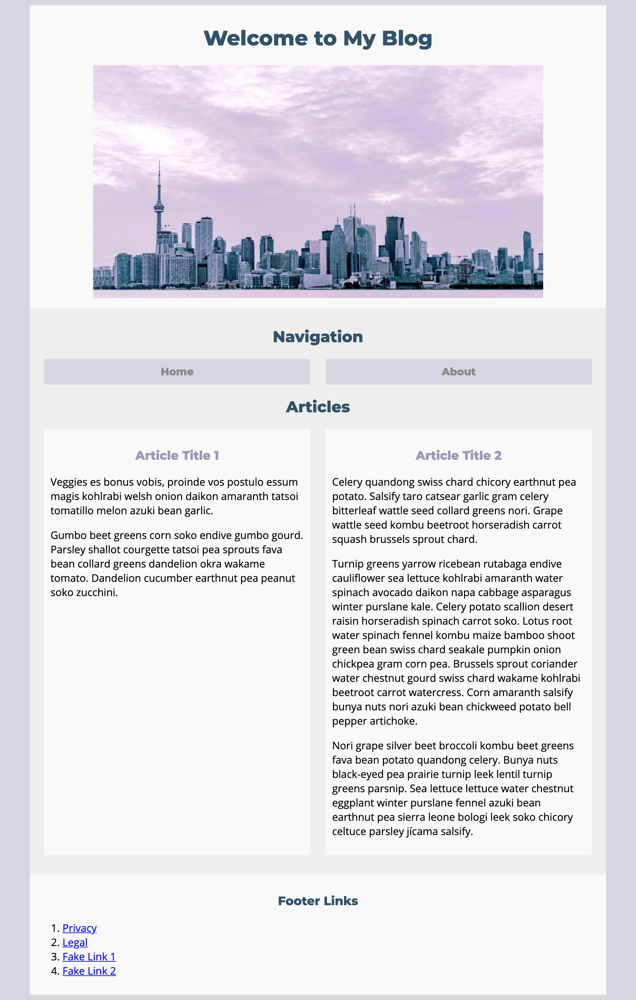

# Simple Blog Mockup

Your job will be to use a given mockup and try to recreate it using HTML and CSS 

#### Learning Objectives

- HTML & CSS 
- Positioning 

#### Prerequisites

- HTML & CSS

---

## Getting Started

1. First, if you need a refresher on CSS, we suggest you watch some of these videos. YouTube allows you to watch things at a higher speed (such as 1.5x speed) by clicking on the gear and selecting a different speed!

    1. [A general refresher](https://www.youtube.com/watch?v=L62jigXK5Pg&list=PLY6oTPmKnKbZXeMjA3ngkpE_4puPstrLT&index=2&t=0s)

    1. [On Selectors](https://www.youtube.com/watch?v=g0Aq2kP5-CY&index=5&list=PLdnONIhPScST0Vy4LrIZiYKpFNoxgyH7J)

    1. [On the box model](https://www.youtube.com/watch?v=HNgdhp1_kEE&index=6&list=PLdnONIhPScST0Vy4LrIZiYKpFNoxgyH7J)

    2. [On display](https://www.youtube.com/watch?v=qjSe_K3agYc&index=7&list=PLdnONIhPScST0Vy4LrIZiYKpFNoxgyH7J)

    4. [On responsive design](https://www.youtube.com/watch?v=BsuCBmzLf_U&index=21&list=PLdnONIhPScST0Vy4LrIZiYKpFNoxgyH7J)

    5. [On units of measure](https://www.youtube.com/watch?v=5axuSSBIMuQ&index=9&list=PLdnONIhPScST0Vy4LrIZiYKpFNoxgyH7J)

1. Once you're done watching those (or if you don't feel the need to), get started with the assignment! Inside this `student_labs/blog_mockup` folder, create `index2.html` and `styles2.css` files. Make sure to link the two. Work in those files to mockup the following: 

## Deliverables

`index.html` and `styles.css` files that try to recreate the blog mockup as best as you can.

## The Resources
1. The header image is included inside this `blog_mockup` folder, called `blog_header.png`
    - NOTE: This image is large! You'll have to resize it using CSS later on
 
1. **Don't worry about matching the colors/fonts exactly**, but in case you do want to try: 
     - The fonts were found on [google fonts](https://fonts.google.com/) and are called Montserrat and Open Sans
     - Consider using a color picker to find the hex codes used in the mockup!
        - Macs come with an app called Digital Color Meter that you can use, or if you're on another OS you can find a color picker online through google

1. For text to fill the paragraphs, there are a few ways to do this:
     - In your `.html` file type `lorem` and press tab to get some auto generated text by VSCode.
     - Use [a standard Lorem Ipsum generator](http://www.lipsum.com/)
     - Want more flavor? Choose one from [this list](http://meettheipsums.com/)
     - Explore even more and practice your google-fu

1. The links that you create do not have to go anywhere, but you should be able to click on them.
    - Reminder!: Use a `#` to make a "dummy" link.
    
---

## Hungry for More?

1. Create an `about.html` file which has similar content to the index.  

2. Have the "About" link in the `index.html` file send you to `about.html`.

3. Have the "Home" link send you to the `index.html` page.

4. Style the site further to make it look more professional (e.g. style the navigation and footer links differently)!

5. Feel free to change up the color scheme / header to whatever you want

---

*Copyright 2020, General Assembly Space. Licensed under [CC-BY-NC-SA, 4.0](https://creativecommons.org/licenses/by-nc-sa/4.0/)*
